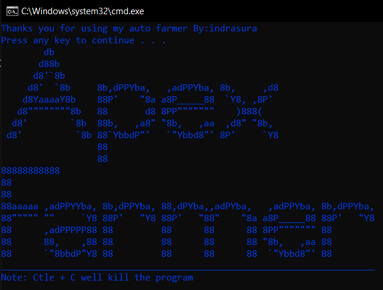

# Apex AFK Farm Bot

The Apex AFK Farm Bot is a powerful automation tool designed to assist Apex Legends players in farming in-game rewards while being AFK (Away From Keyboard). This repository provides the source code and instructions for using the bot effectively.

This script automates certain actions in the game using Python libraries such as pyautogui, keyboard, and PyScreeze. It simulates human behavior by interacting with the game interface based on screen recognition.



## Installation
- WINDOWS installation
    1. Install Python
    2. Run [Installing python.bat](https://github.com/iIndrasura/apexAFKfarmbot/blob/main/Installing%20python.bat), this will install all package and dependencies required to run this program
    3. If you encounter a "The Pillow package is required to use this function" error, run
    ```bash
    pip install Pillow --upgrade
    ```
4. Run Start.bat to execute the script

- Linux:
    1. Run sudo apt-get install python3 to install Python 3.
    2. Install the required libraries by running the following commands:
        - pip install PyScreeze
        - pip install keyboard
        - pip install pyautogui
        - pip install opencv-python
        - pip install Pillow --upgrade

**Important:** Before running the script on Linux, execute sudo su to switch to the root user. Then, run python3 ApexFarmer.py or python ApexFarmer.py to start the script.

## FAQ
1. AFK Farm Bot not working, To ensure optimal performance, please ensure that your monitor is set to a resolution of 1920 x 1080 and an `Aspect ratio` of 16:9. Additionally, make sure to set the `Display Mode` to Borderless Fullscreen in the game settings->`video` menu. These settings will help ensure accurate screen recognition and proper execution of the automation script.

2. I'm getting a Display ConnectionError when running the script on Linux. How do I fix it

Run the following commands:
```bash
sudo su
xhost +local:$USER
```
If you encounter the Display ConnectionError again, try running:
```bash
xhost +local:$USER > /dev/null
```

## Contributing
Contributions are welcome! If you have any suggestions, bug fixes, or new features to add, feel free to open an issue or submit a pull request.

**Disclaimer: The usage of this script is at your own risk, and the developer takes no responsibility for any consequences resulting from its use.**